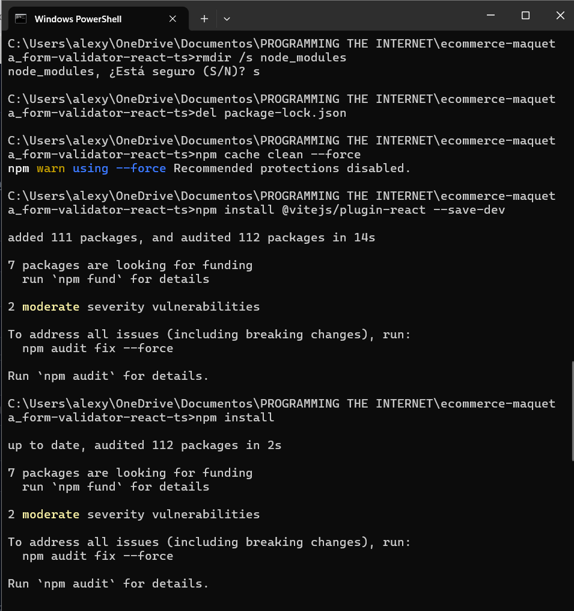
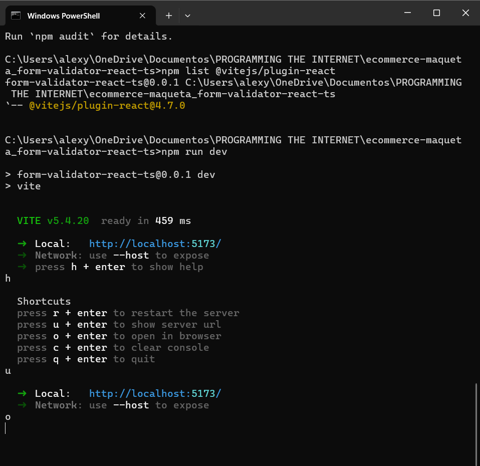
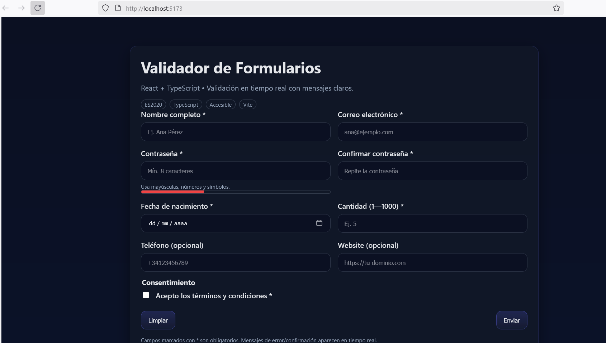
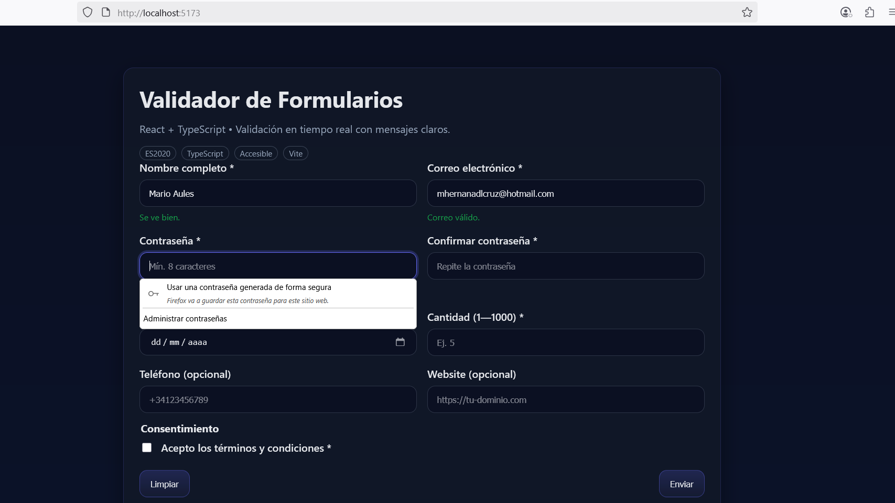
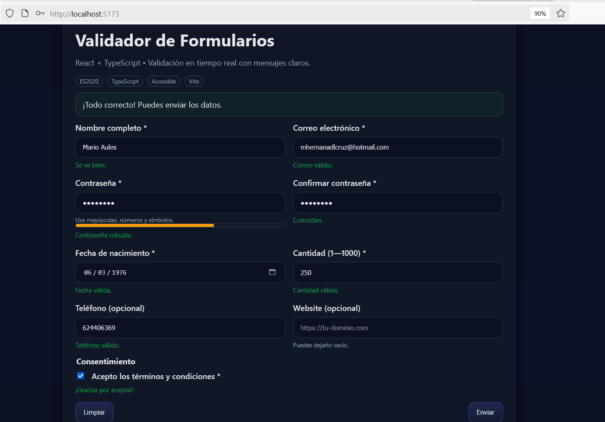

# Validador de Formularios — React + TypeScript

Aplicación web con validación dinámica en tiempo real. Construida con **React**, **TypeScript** y **Vite**.
Propósito: Demostrar validaciones en tiempo real en un formulario moderno.

Incluye validaciones de:
- Nombre obligatorio
- Correo electrónico
- Contraseña con medidor de fortaleza
- Confirmación de contraseña
- Fecha de nacimiento (\>= 18 años configurable)
- Campo numérico en rango (1–1000)
- Teléfono y Web como opcionales
- Aceptación de términos

## Tecnologías
- React 18
- TypeScript 5.x
- Vite
- CSS moderno

## Implementación
Validadores en `validators.ts` con funciones puras, barra de fortaleza, mensajes instantáneos, y gestión de estado con Hooks.

## Desafíos y Soluciones
| Desafío               | Solución                                     |
|-----------------------|-----------------------------------------------|
| Campos opcionales     | Helper `optional()` reutilizable.             |
| Confirmación de clave  | Uso de función `isSameAs` dinámica.          |
| Accesibilidad         | Uso de `aria-describedby` y buen contraste.   |

## Ejecutar

```bash
# 1) Instalar dependencias
npm install

# 2) Servidor de desarrollo
npm run dev

# 3) Compilar para producción
npm run build
npm run preview
```

## Estructura

```
src/
  App.tsx          # Formulario + gestión de estado
  validators.ts    # Reglas puras de validación (reutilizables)
  styles.css       # Estilos base
```

## Integración en un proyecto existente

- Copia `validators.ts` y úsalo en tu framework preferido (React/Vue/Angular).
- Todos los validadores son funciones puras: fáciles de testear y reutilizar.
- Mensajes de error **claros** y consistentes.

---

## Capturas de pantalla








---

## Accesibilidad

- Etiquetas `label` vinculadas
- Mensajes de error semánticos
- Pistas (`aria-describedby`) en contraseña
- Colores con buen contraste

---

© 2025-09-22
